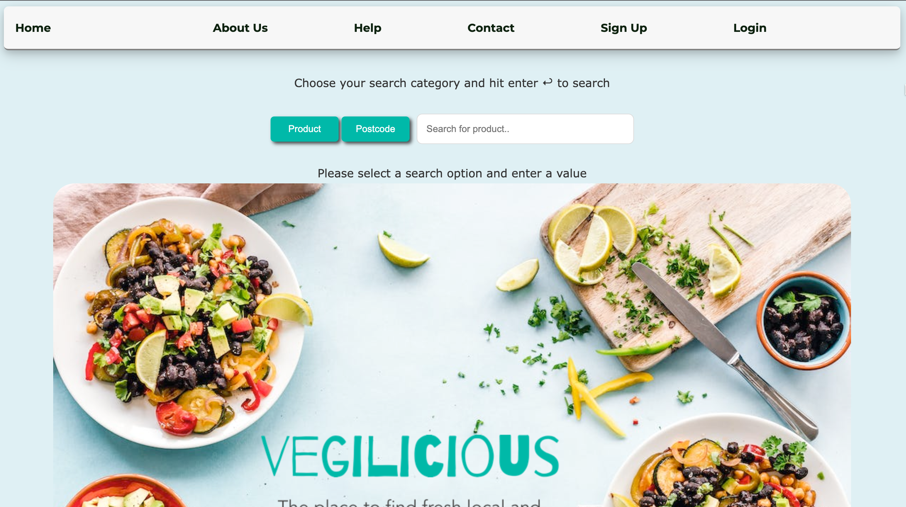
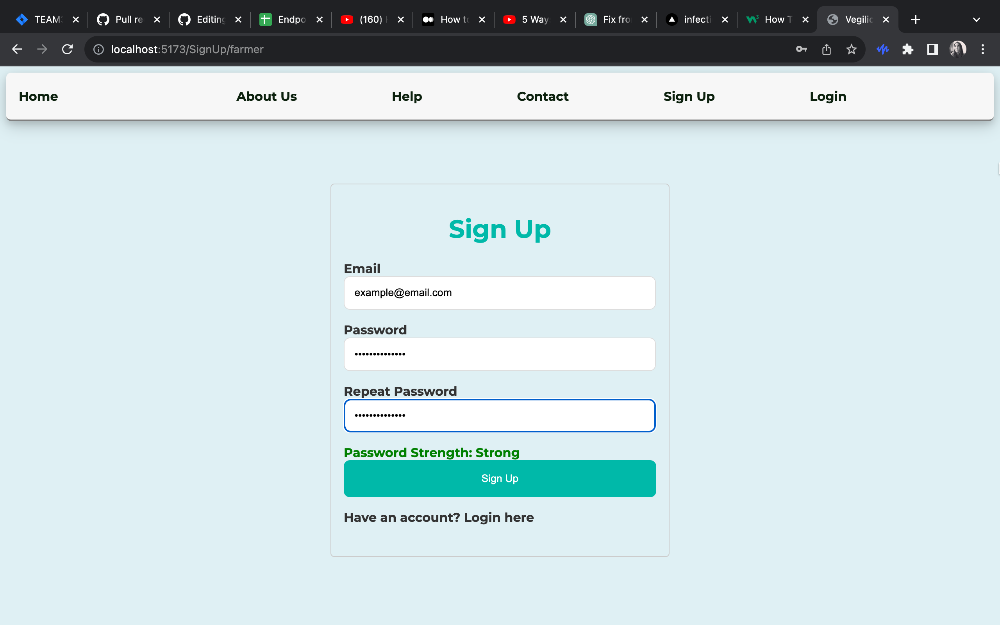

# Vegilicious



An app for farmers to post pictures and descriptions of their produce and for users to contact farmers of their intention to buy products.


[Video Demo](https://drive.google.com/file/d/13i6RQMSTZQbg1_eEgi_l6MLxpZO-H1qU/view?usp=drive_link)

## Goal and Key Features


Technology has meant that people can now access food online in a variety of apps. There is also a need for small local producers to have a space where they can showcase the produce they have so that people can purchase it. Farmers and clients are both required to registered an account and login for verification.
We worked hard to come up with a project idea during our first sprint and finally we decided on the idea of this app.

### User Interface





### Collaborations

The app was designed and worked on by 7 team members. Tasks were divided into front end and back end. Valeria was the product owner and held meetings at least 3 times a week as well as doing some backend coding. Three members of the team, Valeria, Justin and Robi were engaged in working the backend with Robi working on deployment. Four members of the team Jena, Shanis, Debbie and Becky worked on frontend tasks. Valeria created a Jira board where we could all enter and assign tasks to work on. People chose to work on whatever tasks they felt most comfortable with and they were also able to work on learning new technologies to extend their skills if they chose. Debbie needed to learn react and typescript as these were new to her having previously coded in Python using Flask and Django. Becky set up an agile stand up sheet in google docs where people could add accomplishments on a daily basis; this helped with sprint planning. Our main meeting was on Friday afternoon where we talked about what had been accomplished in each sprint and planned for the next one, using the agile methodology to plan and manage our work.

## Installation and Setup Locally

To start the project locally type, please install the following software:

### Prerequisites

- **npm**

  - Install the latest version of npm globally:
    ```sh
    npm install npm@latest -g
    ```

- **MongoDB**
  - Ensure MongoDB is installed and running on your machine.

### Installation

1. **Clone the Repository**

   - Use the following command to clone the repo:
     ```sh
     git clone https://github.com/chingu-voyages/v46-tier3-team-33
     ```

2. **Install NPM Packages**

   - Install npm packages in both the frontend and backend folders:
     ```sh
     cd frontend
     npm install
     cd ../backend
     npm install
     ```

3. **Create .env Files**

   - Create `.env` files in both the frontend and backend folders.

4. **Set Up Environment Variables in Backend**
   - In the backend `.env` file, set the following variables:
     ```
     BACK_HOST=localhost
     BACK_PORT=8081
     MONGODB_URL="mongodb://0.0.0.0/vegilicious"
     JWT_SECRET=""
     NODE_ENV="development"
     FRONTEND_HOST="http://localhost:5173"
     ```
   - Adjust these variables based on your setting.

### Running the Project Locally

To start the project:

1. **Frontend**

   - In the frontend directory, run:
     ```sh
     npm run dev
     ```

2. **Backend**

   - In the backend directory, run:
     ```sh
     npm start
     ```

3. **Access the App**
   - Open your browser and go to:
     ```
     http://localhost:5173/
     ```

To stop the project:

- Use `Ctrl + C` in the terminal.

## Tech Stack

To develop the Vegilicious app we made use of the following stack of technologies:

- **Frontend**:

  - [HTML5](https://developer.mozilla.org/en-US/docs/Web/Guide/HTML/HTML5)
  - [CSS3](https://developer.mozilla.org/en-US/docs/Web/CSS)
  - [React](https://reactjs.org/)
  - [TypeScript](https://www.typescriptlang.org/)

- **Backend**:

  - [Node.js](https://nodejs.org/)
  - [Express.js](https://expressjs.com/)
  - [TypeScript](https://www.typescriptlang.org/)

- **Database**:
  - [MongoDB](https://www.mongodb.com/)

## Frontend and Backend Design

### Frontend

- Includes pages for:
  - Home
  - About
  - Contact
  - Help
  - Login/Signup
  - Logout
  - Search
  - Results

### Backend

- Implements RESTful API principles for efficient data handling.
- Includes CRUD (Create, Read, Update, Delete) operations.

## Deployment

- Hosted on [Vercel](https://vercel.com/).

## Future Enhancements

- **Email Notifications**: Notify users about new products based on their interests.
- **User Reviews**: Allow users to post reviews of purchased products.
- **Product Categorization**: Enable streamlined search by categorizing products.
- **Community Forum**: Facilitate interactions between users and farmers.

## Credits

#### We would like to give credit to the following individuals, organizations, and resources that have contributed to the project or provided inspiration:

- We used Unsplash for many of the photos on the app. In particular:

  - Root vegetable picture: Photo by Nathan Dumlao on Unsplash

  - Question mark picture: Photo by Simone Secci on Unsplash

- A very big thank you to [Chingu](https://www.chingu.io/) for all the help and support, documentation and very useful articles during this project.
